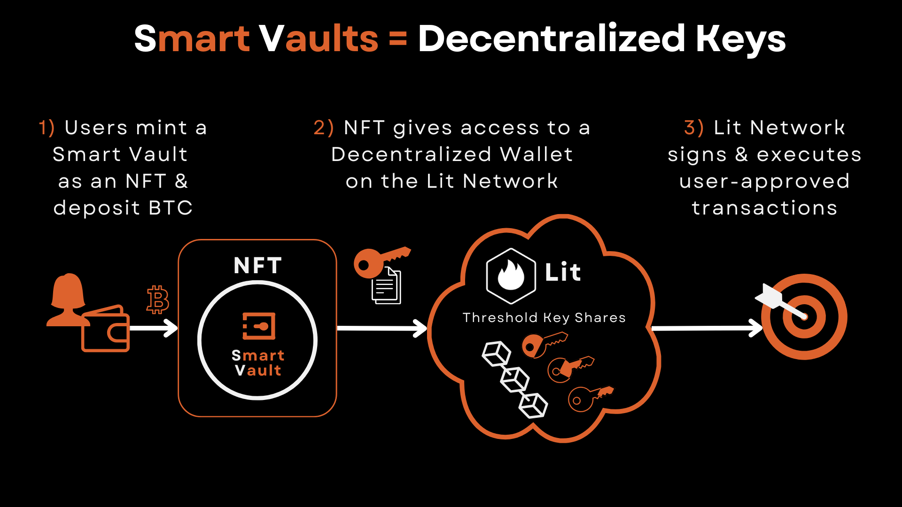

# 🟠 Smart Vaults

Smart Vaults are programmable, multi-chain vaults represented by NFTs. Each Smart Vault has an associated decentralized key pair (PKP) from [Lit Protocol](https://litprotocol.com), enabling secure, permissioned signing across Bitcoin and EVM chains — without ever exposing the private key.

***

## What is a Smart Vault?

A Smart Vault is:

* An **NFT** that grants ownership and operational control
* A **Lit PKP** (Programmable Key Pair) that enables decentralized signing
* A **Bitcoin + EVM address** derived from the PKP public key
* A set of **Lit Actions** (JavaScript smart contracts) that define what it can do

<figure><figcaption>
Smart Vaults are Decentralized Keys
</figcaption></figure>

***

## Lit Protocol Overview

Lit Protocol powers the secure signing mechanism for Smart Vaults.

### Key Features:

* **DKG (Distributed Key Generation)**: m-node network generates and holds key shares
* **Threshold Signing (≥n/m)**: No full key ever exists; only node consensus can sign
* **TEEs (Trusted Execution Environments)**: Lit Actions run securely, isolated from outside interference
* **Periodic Key Rotation**: Key shares are invalidated and refreshed frequently for added security

📎 Learn more: [https://litprotocol.com](https://litprotocol.com)

***

## 🔑 PKP (Programmable Key Pair)

Each Smart Vault is bound to a unique Lit PKP. The public key is used to:

* Derive a **Bitcoin SegWit (or Taproot) address**
* Derive an **EVM address** (for use on CoreDAO, Ethereum, etc.)

The **NFT owner** is the only party authorized to sign transactions using the PKP.

***

## 🧪 Lit Actions (Secure JS Smart Contracts)

Smart Vaults are only allowed to run **hardened Lit Actions**:

1. `signBitcoinTx` – Sign Bitcoin staking or redemption transactions.
2. `callContract` – Trigger EVM transactions (e.g., ERC20 transfers, swaps, claims).
3. `coinTransfer` – Tranfer EVM native coin (e.g., CORE, ETH).
4. `decryptSecrets` – Retrieve encrypted data (e.g., strategy prompts, Telegram handles).
5. `delegate` – Grant permission to approved agents (like VaulterBTC) with on-chain policies.

These actions are:

* Deployed to [IPFS](https://ipfs.tech)
* Indexed by content hash (CID)
* Registered on-chain and enforced by policy contracts

***

## 🔐 Permissioned Execution

Every Lit Action is wrapped with:

* `checkLitAuthAddressIsERC721Owner.ts`: Confirms that the signer owns the controlling NFT
* A call to the **PKPPermissions** contract to check the CID is allowed for this PKP
* If any condition fails, the action is aborted

Smart Vaults also **disable signEcdsa**, which blocks pre-signing and rug attempts.

***

## 🔍 Verifiability

All components are public and inspectable:

* PKP Token ID and public key: visible in VaultLayer UI
* Permissions: inspectable on [Lit Explorer](https://explorer.litprotocol.com)
* Lit Actions: fetch CIDs from chain, load from [IPFS](https://ipfs.tech), review raw JS code
* Policies: fully encoded on-chain and linked to each tool + agent

VaultLayer provides verification scripts in the [VaultLayer GitHub repo](https://github.com/VaultLayer) to audit all permitted actions for any Smart Vault.

***

## 🧬 Design Principles

<table><thead><tr><th width="231.0389404296875">Design Goal</th><th>How It's Achieved</th></tr></thead><tbody><tr><td>Private key secrecy</td><td>Threshold signing with DKG (no single node can sign alone)</td></tr><tr><td>Agent control limits</td><td>On-chain tool + policy contracts</td></tr><tr><td>NFT ownership binding</td><td>Runtime validation of signer via <code>checkERC721Owner</code></td></tr><tr><td>Verifiability</td><td>All logic hosted on IPFS + registered on-chain</td></tr><tr><td>Anti-rug enforcement</td><td><code>signEcdsa</code> disabled; no pre-signed txs</td></tr></tbody></table>

***

## Summary

Smart Vaults combine NFT-based control with Lit Protocol’s decentralized signing to deliver:

* ✅ Fully programmable Bitcoin + EVM wallets
* ✅ Tradeable and transferable vaults (NFT = control)
* ✅ Verifiable automation with no private key risk
* ✅ Real-time agent delegation without backend trust

This architecture allows VaultLayer to offer secure, user-owned DeFi automation — turning Bitcoin into a programmable asset without compromising its core principles.

