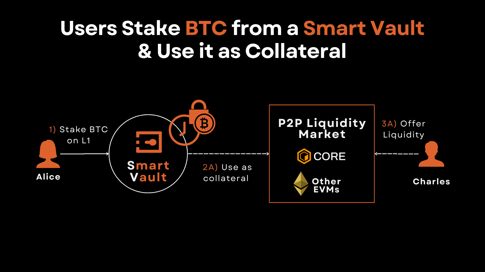

# Borrow $CORE with NFT

Go to [https://app.vaultlayer.xyz/](https://app.vaultlayer.xyz/) and **Connect** with your Ethereum wallet holding your Core DAO NFT

⚠️ Make sure to use your Core DAO (EVM or "0x...") address:

<figure><figcaption>
Connect with EVM wallet holding Core DAO NFT
</figcaption></figure>

Select "Ethereum Wallet" and click "Connect" with your preffered Core DAO wallet:

<figure><figcaption>
Connect with Ethereum Wallet
</figcaption></figure>

Click on **Portfolio**.

<figure><figcaption>
Click to check your Core DAO NFTs
</figcaption></figure>

You should see your available Core DAO NFTs.

Click on the **>** icon to check some available actions for it:

<figure><figcaption>
Enter to check your Core DAO NFT Smart Vault details
</figcaption></figure>

Click on **Use as Collateral**:

<figure><figcaption>
Click to use your Core DAO NFT as collateral to borrow $CORE
</figcaption></figure>

Initiate a Loan Request by specifying:

* Loan Amount: In $CORE.
* Max Interest Rate Willing To Pay: 50% - 500% APR.
* Loan Duration: 1 - 90 days.

Click on **List**, then **Confirm** the **Allowance** and **Transaction** requests in your wallet:

<figure><figcaption>
Initiate a Loan Request
</figcaption></figure>

If all went out smoothly, you should get a SUCCESS txId:

<figure><figcaption>
Successful Loan Request Confirmation
</figcaption></figure>

You can close the pop-up window and click on **Loans v1**:

<figure><figcaption>
Click on Loans v1 Market
</figcaption></figure>

Your Loan Request will show up at the bottom as "New":

<figure><figcaption>
Loan Requests List
</figcaption></figure>

:warning: If you want to Cancel Loan, you can also do it from this section.

Once a lender performs a bid on your loan request, you will be able to accept it:

<figure><figcaption>
Accept Loan Bid
</figcaption></figure>

Check the loan terms and click **OK**:

<figure><figcaption>
Read and confirm loan acceptance
</figcaption></figure>

If all went out smoothly, you will get a confirmation for the Accept Loan request:

<figure><figcaption>
Accept Loan confirmation
</figcaption></figure>

:information\_source: You can check the status of any active loans on the **Liquidity Market** / **Borrowed** section.

To Repay the loan and get back your NFT collateral, click on the Repay button:

<figure><figcaption>
Click to Repay Loan
</figcaption></figure>

Confirm the repayment value and sign the transaction:

<figure><figcaption>
Confirm to Repay Loan
</figcaption></figure>

You should get a TX ID confirming you successfully repaid your loan:

<figure><figcaption>
Repay Loan Successful
</figcaption></figure>

At this point you would have successfully recovered your Core DAO NFT collateral.
